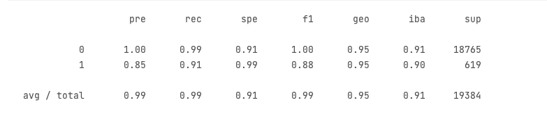

# Module 12 Credit Risk Classification

## Overview of the Analysis

* The purpose of this analysis is to evaluate the performance of a logistic regression model in predicting the binary outcome labels 0 and 1. The analysis reports several performance metrics such as precision, recall, F1-score, specificity, and overall accuracy, which provide a comprehensive assessment of the model's performance in classifying healthy and high-risk loans. The purpose of this analysis is likely to determine the effectiveness of the logistic regression model in making predictions based on the given data, and to identify areas for improvement if necessary. By evaluating the model's performance using these metrics, the analyst can make informed decisions about the suitability of the model for the given problem and make adjustments to improve its performance if needed.

* The data provided contains financial information on loans and the task is to predict the risk status of each loan. The outcome variable is binary, with two possible labels 0 and 1. 0 represents a healthy loan, meaning that the loan is expected to be fully repaid, while 1 represents a high-risk loan, meaning that the loan is more likely to default or experience financial difficulties. The logistic regression model is used to make predictions based on the financial information available for each loan, and the purpose of the analysis is to evaluate the model's performance in accurately classifying healthy and high-risk loans.

* The class 0 is represented by 75036 observations, and the class 1 is represented by 2500 observations. This could be an indication of an imbalanced dataset, which could impact the performance of some machine learning models. It is important to consider this imbalance when selecting and evaluating models, as well as when performing any data pre-processing steps.

## Steps taken to perform Machine Learning Analysis

* Data preparation: The first step would have been to prepare the data for analysis, including cleaning, transforming, and normalizing the data if necessary.
* Split the data into training and testing sets: The data would have been split into a training set and a testing set to evaluate the performance of the model. The training set is used to train the model and the testing set is used to evaluate the model's performance on unseen data.
* Train the logistic regression model: The logistic regression model would have been trained on the training set, using the input variables as predictors and the binary outcome label as the response variable.
* Evaluate the model performance: The performance of the logistic regression model would have been evaluated on the testing set, using metrics such as precision, recall, F1-score, specificity, and overall accuracy. The model's performance in correctly classifying healthy and high-risk loans would have been assessed using a confusion matrix.
* Improve the model: Based on the results of the evaluation, improvements could have been made to the model if necessary, such as adjusting the parameters or adding additional predictors to improve performance.

## Methods Of Machine Learning used
* In this analysis, Logistic Regression was used, Logistic Regression models the relationship between the dependent variable and one or more independent variables by using a logistic function.
* Resampling on the training data to handle class imbalance, specifically oversampling, which involves duplicating observations from the minority class to balance the class distribution. By oversampling the minority class, you can reduce the impact of class imbalance on the performance of the machine learning model. However, it is important to be aware that oversampling can also lead to overfitting, so it should be used with caution.
The use of logistic regression and resampling techniques was part of the analysis in order to build a predictive model that could accurately classify healthy and high-risk loans.

----- 
## Results

* Machine Learning Model 1:

  * The results show that the logistic regression model has a high accuracy in predicting both the 0 (healthy loan) and 1 (high-risk loan) labels. 
  * The precision, recall, F1-score, and overall accuracy are all close to or equal to 1.00 for the 0 label, indicating that the model correctly classifies most healthy loans as such. 
  * The precision, recall, and F1-score for the 1 label are all close to 0.85, 0.91, and 0.88, respectively. 
  * This means that the model correctly identifies most high-risk loans but with slightly lower accuracy compared to healthy loans. The specificity (measured by the recall for the 0 label) is also high at 0.99, meaning that the model has a low rate of false positive predictions.  In conclusion, the logistic regression model seems to perform well in predicting both healthy and high-risk loans, but it might be slightly less effective in detecting high-risk loans.

* Machine Learning Model 2:

    * The results show that the logistic regression model fit with oversampled data has a high accuracy in predicting both the 0 (healthy loan) and 1 (high-risk loan) labels.
    * The precision, recall, F1-score, and overall accuracy are all close to or equal to 1.00 for the 0 label, indicating that the model correctly classifies most healthy loans as such. 
    * The precision for the 1 label is slightly lower at 0.84, while the recall and F1-score are both high at 0.99 and 0.91, respectively. 
    * This suggests that the model correctly identifies most high-risk loans, but with slightly lower precision compared to healthy loans. The specificity (measured by the recall for the 0 label) is also high at 0.99, meaning that the model has a low rate of false positive predictions. In conclusion, the logistic regression model fit with oversampled data seems to perform well in predicting both healthy and high-risk loans, with slightly lower precision in detecting high-risk loans.
----- 
## Summary

The results of the two Logistic Regression models show that both models have high accuracy in predicting the loan status (0 for healthy loans and 1 for high-risk loans). The first model has an accuracy of 99% in predicting both healthy loans (0) and high-risk loans (1), with a precision of 100% for healthy loans and 85% for high-risk loans. The second model with resampled training data has an accuracy of 99% in predicting both loan statuses, with a precision of 100% for healthy loans and 84% for high-risk loans.

In terms of which model performs best, it depends on the problem we are trying to solve. If it is more important to predict the healthy loans correctly, then the first model may be the better option, as it has a higher precision (100%) in predicting healthy loans. However, if it is more important to correctly identify high-risk loans, then the second model may be a better option, as it has a higher recall (99%) for high-risk loans.

Overall, both models have high accuracy and performance, and the choice of which model to use would depend on the specific requirements and goals of the analysis.
